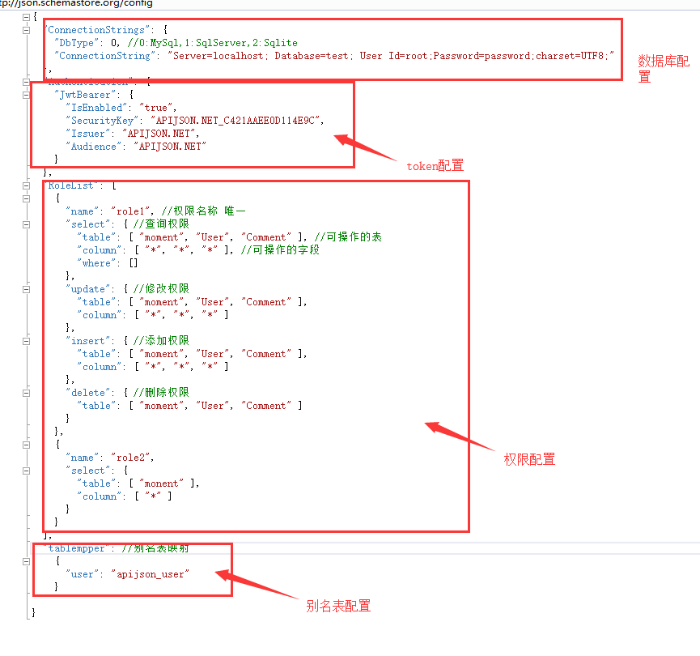
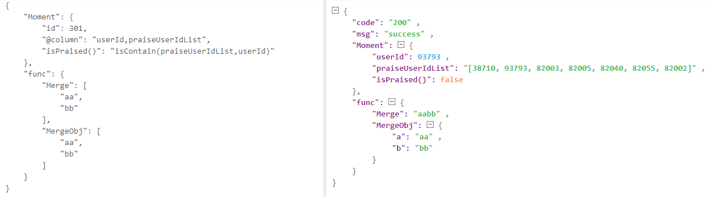
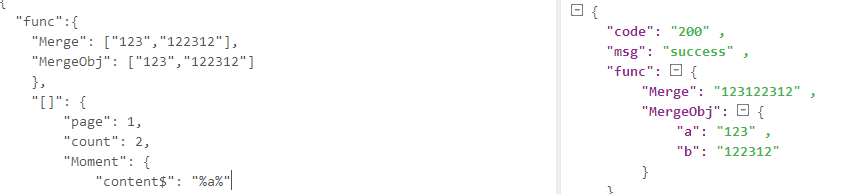

APIJSON后端部署 - .net core

1.下载安装sdk:

windows:https://www.microsoft.com/net/download/thank-you/dotnet-sdk-2.1.301-windows-x64-installer
linux:https://www.microsoft.com/net/download/linux
macos:https://www.microsoft.com/net/download/macos

运行命令验证是否安装成功：dotnet -v
  
2.发布项目

APIJSON.NET文件夹下运行cmd命名：  dotnet publish -c release
（生成在bin/release/netcoreapp2.1/publish目录下）
    
3.运行项目

打开publish文件 运行cmd命令： dotnet APIJSON.NET.dll
      
4：appsettings.json文件配置说明（数据库配置，权限配置，表映射配置）

5:自定义方法调用

可FuncList.cs类里加方法

